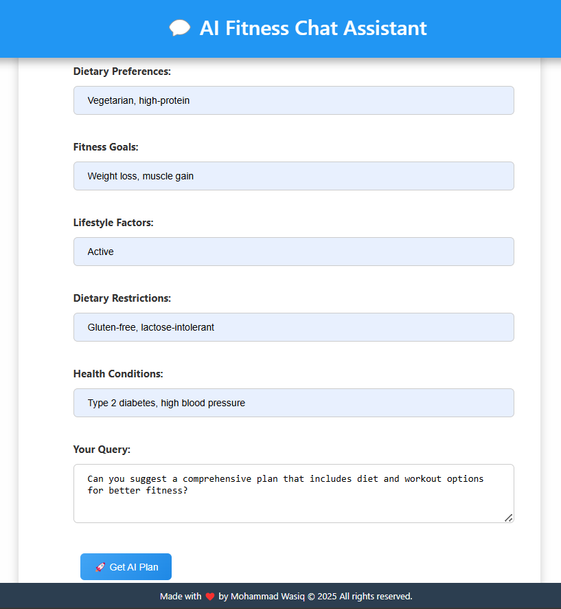
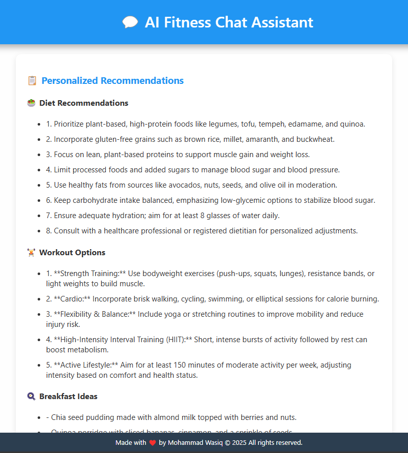
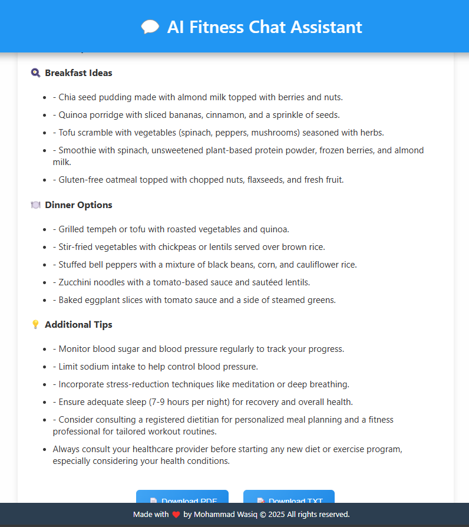

# 💬 AI Fitness Chat Assistant Using EURI

AI-powered web assistant that generates **personalized diet and workout plans** based on user inputs such as dietary preferences, health conditions, and lifestyle factors. It features **dark/light mode**, **PDF/TXT export**, **scroll-free UX**, and a stylish interface.

---

## 🌟 Features

✅ AI-generated fitness & nutrition plans  
✅ Modern UI with dark/light mode toggle  
✅ Beautiful fixed header and footer  
✅ Real-time form submission with loader  
✅ Download results as **📄 PDF** or **📄 TXT**  
✅ Smooth scroll and responsive layout  
✅ Accessible design and form validation

---

## 🏗️ High-Level Design (HLD)

```

User
│
▼
Frontend (HTML, CSS, JS)
│     └── Theme Toggle
│     └── Form Input Handler
│     └── Loader + Output Display
│     └── Export to PDF/TXT
▼
Backend (Flask or Django Suggested)
│     └── /recommendations Route
│     └── AI Response Generator
│     └── Recommendation Engine
▼
AI Model or Logic (Custom Rules / LLMs)

````

---

## 🧠 Low-Level Design (LLD)

### 1. `index.html`
- Fixed **header** and **footer**
- Input fields for:
  - Dietary Preferences
  - Fitness Goals
  - Lifestyle Factors
  - Dietary Restrictions
  - Health Conditions
  - Custom Query
- Submit button triggers form POST to `/recommendations`
- Output section with dynamic `div` for AI recommendations

### 2. JavaScript
- Theme toggle function: `toggleTheme()`
- Loader control via `#loader` div
- Export logic:
  - `downloadPDF()`: blob + FileSaver for `.pdf`
  - `downloadTXT()`: plain blob export
- Utility `getTextFromSection()` for formatting output

### 3. Backend API (`/recommendations`)
- Accepts form data via POST
- Passes query to AI/ML engine or rule-based logic
- Returns structured JSON:
```json
{
  "diet_types": ["Low-carb", "High-protein"],
  "workouts": ["Strength training", "Cardio"],
  "breakfasts": ["Oats with almond milk"],
  "dinners": ["Grilled chicken with veggies"],
  "additional_tips": ["Stay hydrated", "Sleep well"]
}
````

* Rendered dynamically using template engine (e.g., Jinja2)

---

## 🛠️ Tech Stack

| Layer    | Technology                                |
| -------- | ----------------------------------------- |
| Frontend | HTML, CSS, JavaScript                     |
| Styling  | Custom CSS (no frameworks)                |
| Backend  | Flask / Django / FastAPI                  |
| AI Logic | Rule-based or LLM (ChatGPT, Gemini, EURI, etc.) |
| Export   | Blob + `download()` for TXT/PDF           |
| UI/UX    | Responsive, Accessible Design             |

---

## 📂 Folder Structure (Recommended)

```
AI-Fitness-Chat/
├── database/
│   └── database.db
├── static/
│   └── css/
│   └── js/
├── templates/
│   └── index.html
├── app.py
├── requirements.txt
└── README.md
```

---

## 🚀 How to Run

```bash
# Clone the repo
git clone https://github.com/MohammadWasiq0786/AI-Fitness-Chat.git

# (Optional) Create virtual environment
python -m venv venv
source venv/bin/activate  # or venv\Scripts\activate on Windows

# Install dependencies
pip install -r requirements.txt

# Run the app
python app.py
```

---

## 📄 Example Output







---

## 💡 Future Enhancements

* 🧠 AI model integration (OpenAI/Gemini API/EURI)
* 🧾 Save user session history
* 📊 Admin dashboard for tracking queries
* 💬 Chatbot-style interaction history

---

## 👨‍💻 Developed By

Made with ❤️ by \[Mohammad Wasiq]

---
